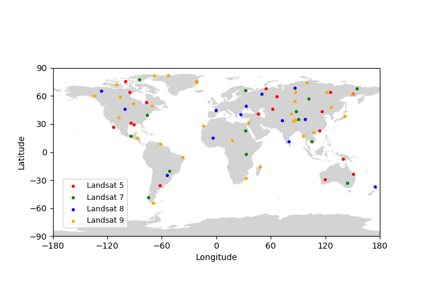

# **landsat5789-water (Deep learning tutorial for remote senisng image)**
### --- **Title**   
**Deep learning-based surface water mapping using Landsat-5, 7, 8 and 9 images.**
### -- **Content**
- Tutorial of remote sensing image acquisition and groud truth labeling. 
- Tutorial of remote sensing data loader for deep learning.  
- Tutorial of deep learning model building (take unet as example).
- Tutorial of deep learning model training and validation.  
### -- **Ongoing image labeling**
- Number of labeled image reach to 76!! :tada:    
- If you are interested in this propject, welcome to join us! :clap:

